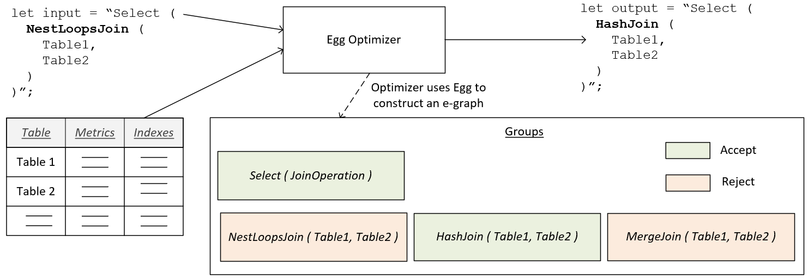

# Egg Plan Transformer (eggplant)

Database management systems convert SQL input statements into query execution plans during the query processing
pipeline.  The query execution plans are provided to the storage engine to determine the particular access methods 
that will be used read and process the stored data file in order to materialize the final query results.  Creating
optimized query plans is one of the critical aspects determining the performance for a DBMS query processor.
Commercial database systems such as SQL Server generally produce high-quality plans for most common use-cases.
Though creating truly optimal plans is known to be an NP-complete problem and optimizers often run with tight
time constraints, making exhaustive enumeration of all possible plans intractable.

This project is investigating specific SQL Server query plan categories that are known to have potential further
optimization opportunities.  It introduces a Egg-based query plan optimizer that post-processes SQL Server query 
execution plans with e-graph saturation techniques to further improve these execution plans.  The optimizer 
looks at a limited set of transformations relating to join order, join algorithm, and index selection.  Since
the post-processor has access to actual cardinalities from the query execution it is possible to detect 
suboptimal operator selections.  The intended use-case is for a SQL query tuning tool that a database programmer 
uses to generate potential query hints that could lead to better query performance.  The below diagram illustrates 
this process at a high-level.

 

 
